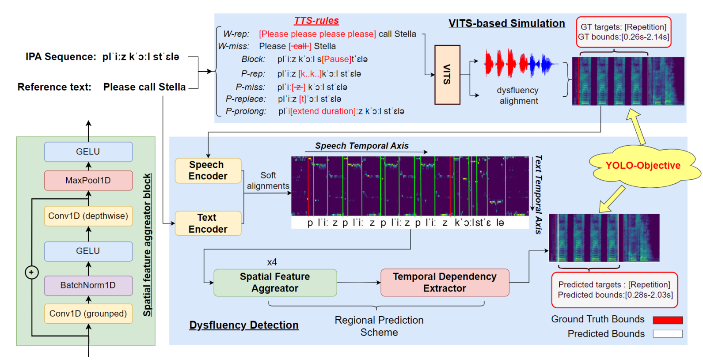

# YOLO-Stutter: End-to-end Region-Wise Speech Dysfluency Detection

## Workflow



## Datasets
We open sourced our two simulated datasets, VCTK-TTS and VCTK-Stutter. The download links are as follows:

| Dataset                        | URL                                                                                            |
|-----------------------------|------------------------------------------------------------------------------------------------|
| VCTK-TTS               | [link](https://drive.google.com/drive/folders/1p5bRQOqMP3AkaoVp3hIGpiJ6ePkYoaeZ?usp=sharing)  |
| VCTK-Stutter                | [link](https://drive.google.com/drive/folders/1EVAetm36uQa0JdTUC2qPUEK3dWRq3qdt?usp=sharing) |


```
${DATASET}
├── disfluent_audio/  # simulated audio (.wav)
├── disfluent_labels/ # simualted labels (.json)	      
└── gt_text/  # ground truth text (.txt)
```


## Environment configuration
Please refer [environment.yml](environment.yml)

If you have Miniconda/Anaconda installed, you can directly use the command: `conda env create -f environment.yml`


## YOLO-Stutter Inference
We opensourced our inference code and checkpoints, here are the steps to perform inference:

0. Clone this repository.

1. Download [VITS pretrained model](https://drive.google.com/drive/folders/1ksarh-cJf3F5eKJjLVWY0X1j1qsQqiS2), here we use `pretrained_ljs.pth`.

2. Download [Yolo-Stutter-checkpoints](https://drive.google.com/drive/folders/1-iD0D3A5IKPrKGfvIr3age8tGVL_yKnL?usp=sharing), create a folder under `yolo-stutter`, named `saved_models`, and put all downloaded models into it.

3. We also provide testing datasets for quick inference, you can download it [here](https://drive.google.com/drive/folders/1AXT6kK8IFKaxoymZxey9WUyfzE5iN43o?usp=sharing).

4. Build Monotonic Alignment Search

```sh
cd yolo-stutter/monotonic_align
mkdir monotonic_align
python setup.py build_ext --inplace
```

5. Run `yolo-stutter/etc/inference.ipynb` to perform inference step by step.

## Dysfluency simulation
We use [VITS](https://github.com/jaywalnut310/vits) as our TTS model.

0. Clone this repository.

0. Download [VITS pretrained models](https://drive.google.com/drive/folders/1ksarh-cJf3F5eKJjLVWY0X1j1qsQqiS2?usp=sharing), here we need `pretrained_vctk.pth` to achieve multi-speaker.
   1. create a folder `dysfluency_simulation/path/to`, and put the downloaded model into it.

0. Build Monotonoic Alignment Search
```sh
cd dysfluency_simulation/monotonic_align
mkdir monotonic_align
python setup.py build_ext --inplace
```
3. Generate simulated speech
```sh
# Phoneme level
python generate_phn.py

# Word level
python generate_word.py
```

## Citation

If you find our paper helpful, please cite it by:
```sh
@inproceedings{zhou24e_interspeech,
  title     = {YOLO-Stutter: End-to-end Region-Wise Speech Dysfluency Detection},
  author    = {Xuanru Zhou and Anshul Kashyap and Steve Li and Ayati Sharma and Brittany Morin and David Baquirin and Jet Vonk and Zoe Ezzes and Zachary Miller and Maria Tempini and Jiachen Lian and Gopala Anumanchipalli},
  year      = {2024},
  booktitle = {Interspeech 2024},
  pages     = {937--941},
  doi       = {10.21437/Interspeech.2024-1855},
}
```
